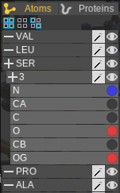
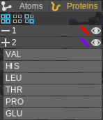

# Interface

## Menu bar

- [Context menu](#1cm)
  - [File](#1fl)
  - [Edit](#1ed)
  - [Options](#1op)
  - [Render](#1rn)
  - [Help](#1hl)

## Bottom bar

- [Animation bar](#2an)

## Inspector tab

- [Particles](#3pr)
  - [Atoms](#3at)
  - [Proteins](#3pt)
- [Colors](#3cl)
- [Graphics](#3gp)
- [Render](#3rd)

## Analysis tab

## Live run tab

# Details

## Context menu

## Bottom bar

## Inspector tab

The inspector tab is the tab on the left.

### Particles
The particles tab lists the molecular information in the scene. When a protein is present, you can switch between atom view and protein view using the topmost buttons.

#### Atoms

Atoms are grouped in order of Residues.

1. Select all residues
2. Deselect all residues
3. Flip select residues
4. Change draw method of selected residue(s)
5. Show/Hide selected residue(s)
6. Change draw method of residue(s)
7. Show/Hide residue(s)
8. Residue name group
9. Residue ID group
10. Atom entry
11. Change atom color

Shift-click to select multiple residues. Selecting an atom will shade the atom in green. Double click to focus on the atom selected.

#### Proteins

Proteins are grouped by chains.

1. Select all proteins
2. Deselect all proteins
3. Flip select proteins
4. Change draw method of selected protein(s)
5. Show/Hide selected protein(s)
6. Change draw method of protein(s)
7. Show/Hide protein(s)
8. Chain residue entry

### Graphics

Graphics settings adjust how the scene is displayed.

Shading

- Classic

    The scene is colored using Lambert and Blinn-Phong lighting. Slightly faster but lower quality.

- PBR

    The scene is colored using physically-based materials and environment maps. Higher quality but slightly slower.

#### Lighting

    Strength: Strength of diffuse lighting (environment strength).

    Falloff: How much the light gets weaker when further away from the camera.

    Specular: The strength of reflection. For PBR, diffuse intensity = 1 - specular intensity.

    Background: Background color.

#### Camera

    Target: always focus on particle(s) during animations.

    Center X,Y,Z: Center of camera rotation.

    Rotation W, Y: Angle of camera.

    Scale: Zoom factor of camera.

    Quality: Draw quality of scene.

    Use Dynamic Quality: Use a different quality when camera is moving. Suitable for heavy scenes.

    Quality 2: Draw quality of scene when camera is moving.

#### Effects

    Ambient occlusion: Darken creases between near objects. Might slow down the scene substantially.

    Shadows (WIP): Directional shadows. Very heavy calculations as the scene is drawn 2 times.

## Analysis tab

## Live run tab