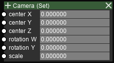

Scene I/O Nodes
===============

Set Camera
----------

Input sockets

==================      ============   =============     ============
Name                    Type           Shape             Description
==================      ============   =============     ============
Center X                double         \-                X coordinate of axis
Center Y                double         \-                Y coordinate of axis
Center Z                double         \-                Z coordinate of axis
Rotation W              double         \-                Horizontal rotation in degrees (0~360)
Rotation Y              double         \-                Vertical rotation in degrees (-90~90)
Scale                   double         \-                Magnification (image is enlarged 2^scale times)
==================      ============   =============     ============