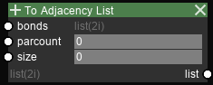
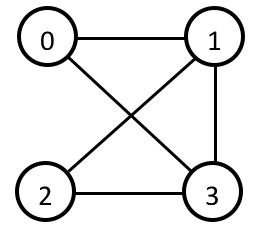

Miscallenous Nodes
==================

Plot Graph
----------

[image]

To Adjacency List
-----------------

Description
~~~~~~~~~~~

Converts data from a paired list to an adjacency list. See `remarks` for the definition of paired lists and adjacency lists.

Input sockets
~~~~~~~~~~~~~

==================      ===============    ===========      ============
Name                    Type               Shape            Description
==================      ===============    ===========      ============
bonds                   list(2i)           any, 2           the paired list to convert
parcount                int                \-               total number of indices
size                    int                \-               list size per index
==================      ===============    ===========      ============

Output sockets
~~~~~~~~~~~~~~

==================      ===============    ===============      ============
Name                    Type               Shape                Description
==================      ===============    ===============      ============
list                    list(2i)           parcount, size       the converted adjacency list
==================      ===============    ===============      ============

Remarks
~~~~~~~

A paired list is pairs of indices indicating "bonds".
For example, the connection above can be represented with the paired list below.

::

   0 1
   0 3
   1 2
   1 3
   2 3

An adjacency list, on the other hand, stores the indices connected to each index in a table-wise fashion.
For example, the same connection can be represented with the adjacency list below.

::

   0   1  3 -1
   1   0  2  3
   2   1  3 -1
   3   0  1  2

In this case, the ``size`` of the list is 3, meaning each index can be connected to a maximum of 3 other indices.
An error will be output if the ``size`` is not big enough to accomodate the whole connection.

.. Tip::

   In general, paired list are preferred for its data density (all connections only appear once, and there are no padding values).
   However, an adjacency list is faster to search for a connection, so use them wisely!

To Paired List
--------------

.. image:: img/tprl.png

Description
~~~~~~~~~~~

Converts data from an adjacency list to a paired list. See `remarks` above for the definition of paired lists and adjacency lists.

Input sockets
~~~~~~~~~~~~~

==================      ===============    ===========      ============
Name                    Type               Shape            Description
==================      ===============    ===========      ============
adjlist                 list(2i)           any              the adjacency list to convert
==================      ===============    ===========      ============

Output sockets
~~~~~~~~~~~~~~

==================      ===============    ===============      ============
Name                    Type               Shape                Description
==================      ===============    ===============      ============
list                    list(2i)           variable, 2          the converted linked list
==================      ===============    ===============      ============