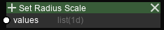

Modifier Nodes
===============

Set Attribute
-------------

.. image:: img/sprm.png

Description
~~~~~~~~~~~

Copies the per-atom values into the specified attribute slot.
The slot can be used to color atoms or for future reading.

Options
~~~~~~~

* Parameter (Dropdown)

   Selects the attribute slot to modify. Non-assigned slots will keep their values.

Input sockets
~~~~~~~~~~~~~

==================      ============   ==============     ============
Name                    Type           Shape              Description
==================      ============   ==============     ============
values                  list(\*d)      PCNT[, FCNT]       see remarks
==================      ============   ==============     ============

Remarks
~~~~~~~

When executed with ``Run``, data for all frames can be provided.
When executed with ``Run All``, data must only be of 1 dimension.

.. todo::

   Change the behavior to:
   If the data has frame data, only the values for the current frame is read.

Set Radii Scale
---------------

==================      ============   ==============     ============
Name                    Type           Shape              Description
==================      ============   ==============     ============
values                  list(1d)       PCNT               radii scale (>0)
==================      ============   ==============     ============

Remarks
~~~~~~~

Radii scale is multiplied with the scale of the radius for the atom type.
The default value is 1. Be careful when setting large values as it may cause a performance impact on the display.

Show Range
----------

.. image:: img/srng.png

Description
~~~~~~~~~~~

For each atom, if the value for that index fall inside/outside the range, the atom is hidden.

Options
~~~~~~~

* Invert (toggle)

=============      ============
State              Meaning
=============      ============
OFF                atoms with values outside the range is hidden
ON                 atoms with values inside the range is hidden
=============      ============

Input sockets
~~~~~~~~~~~~~

==================      ============    ===========      ============
Name                    Type            Shape            Description
==================      ============    ===========      ============
values                  list(1d)          PCNT           value for inspection
min                     int             \-               minimum of range
max                     int             \-               maximum of range
==================      ============    ===========      ============

