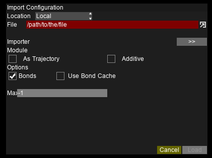
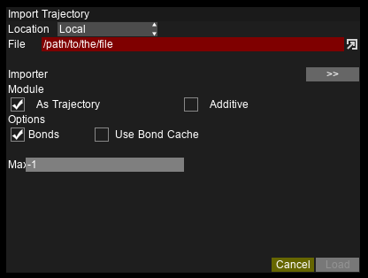

Importing Files
===============

Importing Configurations
------------------------

Configuration files contain the atom types, residue groups, as well as initial positions and other information.

.. Note::

   Currently supported formats: Gromacs(``.gro``), CDView(``.cdv``), Protein Database(``.pdb``), Lammps(``.atom``), DlPoly(``.000``)

Importing Trajectories
----------------------

Trajectory files contain the coordinates (and velocities) for a certain number of frames.
The format of the configuration and trajectory files need not be the same; but the atom count must match.

.. Note::

   Currently supported formats: Gromacs(``.trr``)

Incremental loading
~~~~~~~~~~~~~~~~~~~

For trajectories that come in separate files, AViS can load each file incrementally, thus saving time and data usage.
The total number of frames to load into memory can be set in the ``Preferences``.

.. Note::

   Currently supported formats: Gromacs(``.gro``), CDView(``.cdv``)

.. Important::

    To allow for incremental loading, every filename must have matching formats with an incrementing number at the end.
    The number of figures of the number must be constant. The number may increment by more than 1 every frame, but the rate must be constant.

    Example::
    
        mytrajfile000001.abc
        mytrajfile000003.abc
        mytrajfile000005.abc
        ...

Importing Remote Files
----------------------

AViS can handle remote files the same way as local files.
You are required to connect to the remote server via SSH.

.. image:: img/irmt.png

Remote files are downloaded to a temporary folder, and erased as soon as the file is read into memory.
You can significantly reduce the disk usage by lowering the maximum number of frames loaded into memory; however,
the playback will be slower as they are fetched on-the-fly.