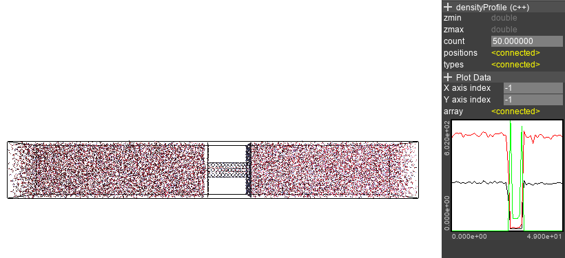
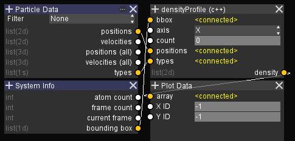

Density Profile
===============

The density profile node shows the number density for each atom type.
You can choose which axis to calculate the density.

The ``count`` parameter controls how many slices to calculate the density profile.
Larger values gives a more detailed graph, but with more noise.

The density of each type has a different index in the 2nd axis,
so the density profile for a single type can be specified with the ``Y axis index`` of the Plotter.

The graph setup is as follows.

