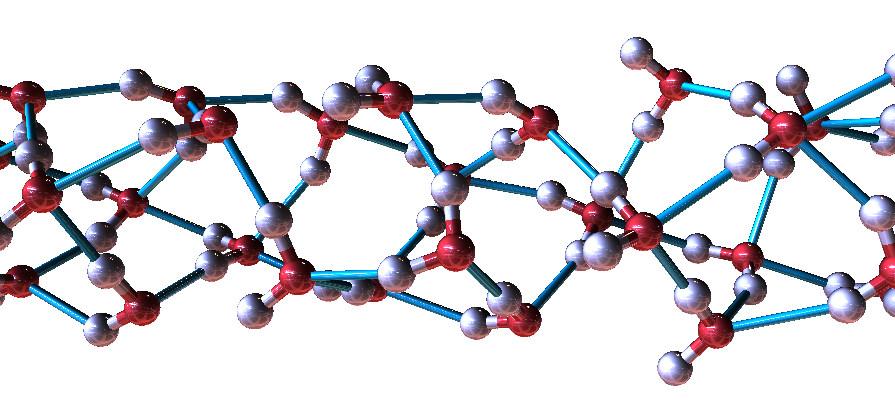
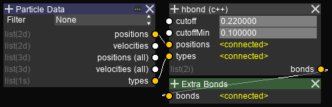

Hydrogen Bonds
==============

The hydrogen bonds node creates bonds between Hydrogen and Oxygen / Carbon / Nitrogen atoms.

The ``cutoffMin`` and ``cutoff`` values specifies the minimum and maximum bond lengths respectively.
A minimum value is required when bonds already exist between atoms of the same residue.

The graph setup is as follows.

.. highlight:: cpp

Source code (Error checking omitted)::

    #include <iostream>
    #include <cmath>
    #include <vector>

    //in
    double cutoff = 0;
    //in
    double cutoffMin = 0;
    //in pcnt 3
    double* positions = 0;
    //in pcnt
    short* types = 0;

    //out ccnt 2
    int* bonds = 0;
    std::vector<int> vcons;

    //var
    int pcnt = 2;
    //var
    int ccnt = 0;

    #define ISA(s, c) (s == *((short*)c))

    //entry
    void Execute() {
        const double cut2 = cutoff*cutoff;
        const double cut2m = cutoffMin*cutoffMin;
        vcons.clear();
        for (int m = 0; m < pcnt; m++) {
            if (!ISA(types[m], "H")) continue;
            double* pm = positions + m * 3;
            for (int n = 0; n < pcnt; n++) {
                if (!ISA(types[n], "O")) continue;
                double* pn = positions + n * 3;
                double dx = pn[0]-pm[0];
                double dy = pn[1]-pm[1];
                double dz = pn[2]-pm[2];
                if (fabsf(dx) < cutoff && fabsf(dy) < cutoff && fabsf(dz) < cutoff) {
                    double d = (dx*dx+dy*dy+dz*dz);
                    if (d < cut2 && d > cut2m) {
                        vcons.push_back(m);
                        vcons.push_back(n);
                    }
                }
            }
        }
        bonds = &vcons[0];
    }

.. raw:: latex

    \newpage