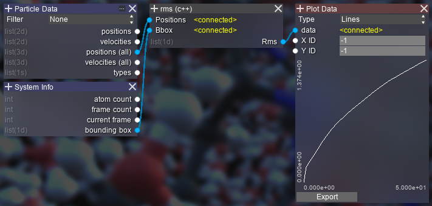

RMS Distance
============

The root mean square distance calculates the particle offset for all frames.
This examples uses the 3-dimensional ``Positions (all)`` input.

.. Note::
    As of this version (0.12c), ``Positions (all)`` do not work for incrementally loaded trajectories.

.. highlight:: cpp

Source code (Error checking omitted)::

    #include <array>
    #include <cmath>
    #include <vector>

    //@in fcnt pcnt 3
    double* positions = 0;
    //@in 6
    double* bbox = 0;

    //@out fcnt
    double* rms = 0;
    std::vector<double> _rms;

    //@var
    int fcnt = 1;
    //@var
    int pcnt = 1;

    void vec(double* to, double* frm, double* v, double* b) {
        for (int a = 0; a < 3; a++) {
            const double l = std::abs(b[a*2] - b[a*2+1]);
            v[a] = (to[a] - frm[a]) / l;
            v[a] -= std::round(v[a]);
            v[a] *= l;
        }
    }
    void add(double* a, double* b, double* v) {
        v[0] = a[0] + b[0];
        v[1] = a[1] + b[1];
        v[2] = a[2] + b[2];
    }
    double len2(double* a) {
        return a[0]*a[0] + a[1]*a[1] + a[2]*a[2];
    }

    //@entry
    void Execute() {
        _rms.resize(fcnt, 0);
        rms = _rms.data();
        rms[0] = 0;

        std::vector<std::array<double, 3>> offset(pcnt), offset_sum(pcnt);

        double* pposo = positions;
        for (int f = 1; f < fcnt; f++) {
            double* ppos = pposo + pcnt * 3;
            for (int p = 0; p < pcnt; p++) {
                auto oft = offset[p].data();
                auto ofts = offset_sum[p].data();
                vec(ppos + p * 3, pposo + p * 3, oft, bbox);
                add(ofts, oft, ofts);
                rms[f] += len2(ofts);
            }
            rms[f] = std::sqrt(rms[f] / pcnt);
            pposo = ppos;
        }
    }

.. raw:: latex

    \newpage
