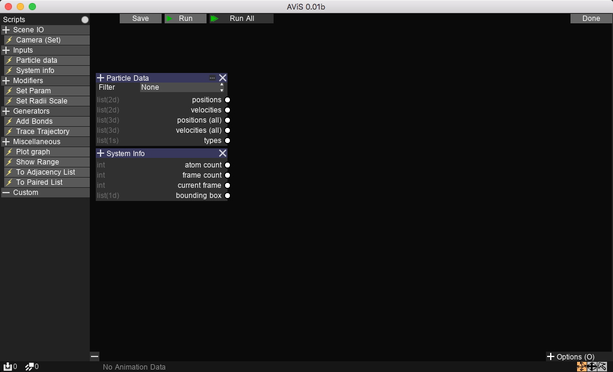
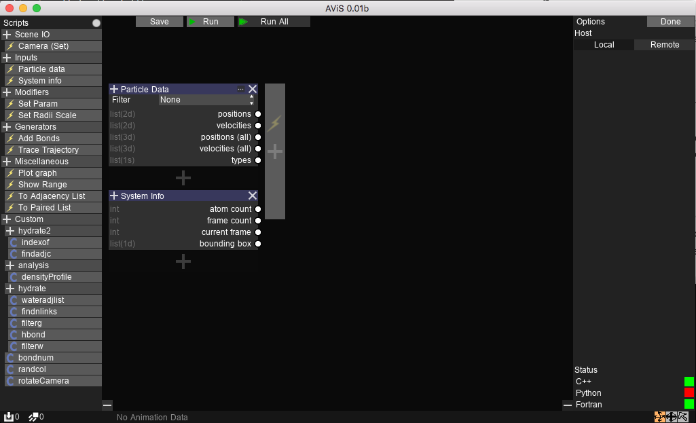
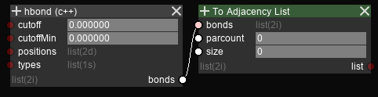
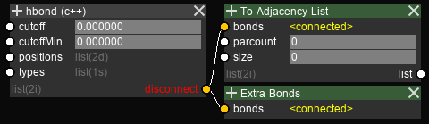

Introduction
============

The analysis framework in AViS is graph-based, where a collection of function is applied to the system,
each containing an arbitrary number of input and output variables.

Terminology
-----------

In AViS, each function is called a ``node``, each input/output connection is called a ``socket``,
and a network of connected nodes is called a ``graph``. The implementation of a node can be ``built-in``,
or extended via C++ / Python / Fortran ``scripts``.

Coloring
--------

Default (extended) nodes are colored grey. These nodes are considered `pure` functions,
and they should only operate on data from input and output sockets.

I/O nodes are colored green. These nodes read from or write to existing data in the scene. An example of which is the
``Particle Data`` node.

Modifier nodes are colored blue. These nodes create new data or visualizations, such as the ``Add Bonds`` node.

Special nodes that have unique operations are colored red, such as the ``Plot Graph`` node.

Designing a graph
-----------------

The graph editor can be accessed using the ``Edit`` button on the top right of the ``Analysis`` tab.
The default view should have 2 nodes already added, the ``Particle Data`` and ``System Info`` nodes.

New nodes can be added by first selecting a node from the ``Nodes`` tab.
Then, the node can be added to anywhere highlighted with a ``+`` sign.
Nodes can be removed with the ``X`` button.

Connections between nodes can be made by clicking on both input and output sockets of the connection.
A connection cannot be recursive (a node can only take data from nodes which execute before it).
However, you can store temporary output on an ``attribute`` node and read from it in the next execution.
An output socket can be connected to multiple input sockets. 

A connection can be removed by hovering over the name of the socket, and clicking on the ``disconnect`` button.
Disconnecting an socket removes all connections from/to that socket.

Execution
---------

Nodes are evaluated top-to-bottom, left-to-right. When executed with ``Run``, the graph is evaluated on data from the current visible snapshot frame.
When executed with ``Run all``, the graph is evaluated ``total frame count`` times for the whole trajectory, and the data is cached for playback;
That is, when the trajectory is played back, the values of all intermediate calculations for each visible frame can be inspected from the UI.

.. Note::

	When executed with ``Run``, all data from the previous ``Run All`` is discarded.