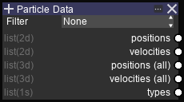
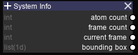

Input Nodes
===========

.. Note::

   ``ACNT`` and ``FCNT`` refers to ``atom count`` and ``frame count`` respectively.

Particle Data
-------------

Options

* Filter (Dropdown multiple-select)

============   ============
Value          Description
============   ============
None           Use data from all atoms
Visible        Only use data from visible atoms
Clipped        Only use data from atoms visible through ``clipping``
============   ============

Output sockets

==================      ============   =============     ============
Name                    Type           Shape             Description
==================      ============   =============     ============
Positions               list(2d)       ACNT, 3           Atom positions for current frame
Velocities              list(2d)       ACNT, 3           Atom velocities for current frame
Positions (All)         list(3d)       FCNT, ACNT, 3     Atom positions for all frames
Velocities (All)        list(3d)       FCNT, ACNT, 3     Atom velocities for all frames
==================      ============   =============     ============

System Info
-----------

Output sockets

==================      ============   =============     ============
Name                    Type           Shape             Description
==================      ============   =============     ============
Atom count              int            \-                Total number of atoms
Frame count             int            \-                Total number of frames
Current frame           int            \-                Current visible frames
Bounding box            list(1d)       6                 Simulation box coordinates, in the order of ``-X, +X, -Y, +Y, -Z, +Z``
==================      ============   =============     ============