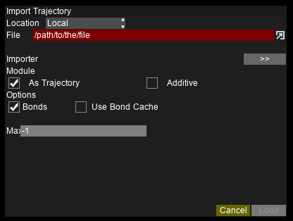

Importing Files
===============

Importing Configurations
------------------------

Configuration files contain the atom types, residue groups, as well as initial positions and other information.
Only a single configuration can be loaded at once.

.. image:: img/icfg.png
    :width: 50%
    :align: center

To open a configuration file, either:

- From the top menu, select ``File/Import`` `, or`
- Drag and drop the file onto the application window `, or`
- If the program is on PATH, execute ``avis name_of_file`` on a terminal

.. Note::

   Currently supported formats: Gromacs(``.gro``), CDView(``.cdv``), Protein Database(``.pdb``), Lammps(``.atom``), DlPoly(``.000``)

Importing Trajectories
----------------------

Trajectory files contain the coordinates (and velocities) for a certain number of frames.
The format of the configuration and trajectory files need not be the same; but the atom count / indices must match.
Only a single trajectory can be loaded at once.

To open a trajectory file:

- From the top menu, select ``File/Import`` `, or`
- Drag and drop the file onto the application window `, or`
- From the bottom animation bar, select ``Import Trajectory`` `, or`
- If the program is on PATH, execute ``avis name_of_configuration_file name_of_trajectory_file`` on a terminal

.. Note::

   Currently supported formats: Gromacs(``.trr``)

.. Note::

   Some formats may contain trajectory data together with the configuration file.
   They may be loaded automatically without this step.

Incremental loading
~~~~~~~~~~~~~~~~~~~

For trajectories that come in separate files, AViS can load each file incrementally, thus saving time and data usage.
The total number of frames to load into memory can be set in the ``Preferences``.

To open an incremental trajectory, simply open the **first** file as the configuration file.
Consecutive frames will be automatically detected and imported. `Do not open / drag-and-drop all the files!`

.. Note::

   Currently supported formats: Gromacs(``.gro``), CDView(``.cdv``)

.. Important::

    To allow for incremental loading, every filename must have matching formats with an incrementing number at the end.
    The number of figures of the number must be constant. The number may increment by more than 1 every frame, but the rate must be constant.

    Example::
    
        mytrajfile000001.abc
        mytrajfile000003.abc
        mytrajfile000005.abc
        ...
        mytrajfile100001.abc

Importing Remote Files
----------------------

AViS can handle remote files the same way as local files.
You are required to connect to the remote server via SSH.

.. image:: img/irmt.png
    :width: 50%
    :align: center

A remote file can be opened by selecting ``File/Import Remote`` from the top menu,
where you may be required to log in to the remote server before choosing the files.

Remote files are downloaded to a temporary folder, and erased as soon as the file is read into memory.
You can significantly reduce the disk usage by lowering the maximum number of frames loaded into memory; however,
the playback will be slower as they are fetched on-the-fly.