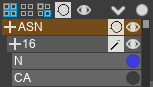
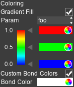
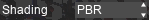
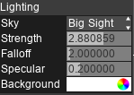
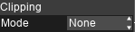
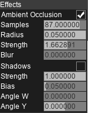

Visualize Bar
=============

The visualize bar is divided into a few tabs:

* Particles tab

   Controls the list of atoms / proteins / meshes.

* Colors

   Controls the attributes and coloring of atoms.

* Graphics

   Controls the options of realtime-rendering of the scene.

* Render

   Controls the options of offline-rendering (image / video output).

* Information

   Displays the math for the nerds, as well as additional information for selected atoms.

Particles Tab
-------------

The particles tab controls the drawing of atoms and proteins.

==========================    ==================
Button                        Function
==========================    ==================
|vexp|                        Expands / Collapses the group
|vsela|                       Selects everything
|vsel0|                       Deselects everything
|vseli|                       Flip selection
|vbal|                        Changes the draw mode (see ``Draw Modes``) of the group / selection
|veye|                        Shows / Hides the group / selection
==========================    ==================

.. |vsel0| image:: img/vsel0.png

Atoms are grouped into Residues -> Residue ID -> atom name.

.. TODO::

   Add the protein section

Attributes Tab
--------------

Attributes
~~~~~~~~~~

Attributes are general data for each particle, optionally animated. A system can have an arbitary number of attributes.
Attributes can be filled with the ``Set Attribute`` node, and queried with the ``Get Attribute`` node.

.. image:: img/cattr.png

Colors
~~~~~~~~

The colors section controls the color for atoms and bonds.

.. image:: img/cols.png

* Bond colors

=====================   ==============
Option                  Details
=====================   ==============
Custom Bond Colors      Use a custom color instead of atom colors
Blend Bond Colors       Blend colors inherited from atoms
=====================   ==============

Radii
~~~~~~~

=====================   ==============
Option                  Details
=====================   ==============
Scale                   Multiply all radii values by this value
=====================   ==============

Bounding Box
~~~~~~~~~~~~~~~

=====================   ==============
Option                  Details
=====================   ==============
Draw                    Draw the Box in 3D view
Center X, Y, Z          Box center coordinates
Periodic                Wrap around atoms outside the bounding box
=====================   ==============

Orientation
~~~~~~~~~~~

* Type

=====================   ==============
Type                    Details
=====================   ==============
Stretch                 Stretch atoms based on directions
Vector                  Draw per-atom arrows toward directions 
=====================   ==============

Graphics Tab
------------

The graphics tab controls the shading of the scene.

* Shading

=========   ==============
Option      Details
=========   ==============
Classic     The scene is shaded with Lambert and Blinn-Phong lighting. Slightly faster but lower quality.
PBR         The scene is shaded with Environment Maps. Higher quality but slightly slower and uses more memory.
=========   ==============

* Lighting

============   ==============
Option         Details
============   ==============
Sky            Environment type (backgrounds are in the backgrounds/ folder)
Strength       Strength of diffuse lighting (environment strength)
Falloff        How much the light gets weaker when further away from the camera
 Offset        Falloff distance starts from this distance from the camera
Specular       The strength of reflection. For PBR, diffuse intensity = 1 - specular intensity
Transparency   Transparency ratio
IOR            Index of Refraction for transparency
Background     Background type: Color, Ambient, Sky
 Color         Background color
============   ==============

* Camera

.. image:: img/gcam.png

=====================   ==============
Option                  Details
=====================   ==============
Follow                  Camera always centers on target
Center X,Y,Z            Camera axis
Rotation W, Y           Camera angle
Scale                   Camera zoom factor
Quality                 Resolution scaling of the scene
Use Dynamic Quality     Use a different resolution scale when moving the camera. Suitable for heavy scenes.
Quality 2               Resolution scaling of the scene when the camera is moving
=====================   ==============

* Clipping

=====================   ==============
Option                  Details
=====================   ==============
None                    All atoms are shown
Slice                   Only atoms in the bounding plane + thickness is shown
Cube                    Only atoms in the bounding volume is shown
=====================   ==============

* Effects

Additional effects to apply to the scene

List of effects available:

   * Glow

   =====================   ==============
   Option                  Details
   =====================   ==============
   Threshold               Minimum brightness value 
   Radius                  Blur radius
   Strength                Additive strength
   =====================   ==============

   * Ambient Occlusion

   =====================   ==============
   Option                  Details
   =====================   ==============
   Samples                 Number of samples to average
   Radius                  Radius for sampling
   Strength                Darken intensity
   Blur                    Blur radius before darkening
   =====================   ==============

   * Depth of Field
   
   =====================   ==============
   Option                  Details
   =====================   ==============
   Distance                Focal distance from camera
   Aperture                Blur amount
   Iterations              Number of blur operations. Larger number is slower but reduces artifacts
   =====================   ==============

Render Tab
----------

* To Image (GLSL)

Produces a high resolution screenshot of the view.

.. image:: img/rimg.png

=====================   ==============
Option                  Details
=====================   ==============
Width                   Width of the image (maximum 16k)
Height                  Height of the image (maximum 16k)
Slices                  Render in parts, improves render speed when the image resolution is very large
MSAA                    Averages the final image over 4 samples. Slower but more beautiful.
=====================   ==============

* To Video (GLSL)

Produces a high resolution screenshot video of the animation playback.

.. image:: img/rmov.png

=====================   ==============
Option                  Details
=====================   ==============
Format                  Video format (GIF / AVI / PNG sequence)
Width                   Width of the video (maximum 16k)
Height                  Height of the video (maximum 16k)
Slices                  Render in parts, improves render speed when the video resolution is very large
MSAA                    Averages the final image over 4 samples. Slower but more beautiful.
Max Frames              Maximum frames to render. Snapshots will be skipped if there are too many frames.
=====================   ==============
